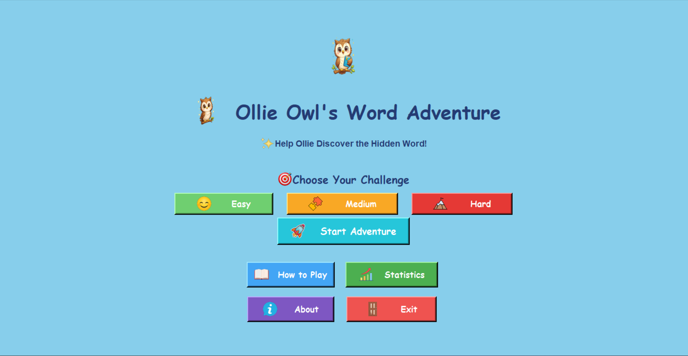
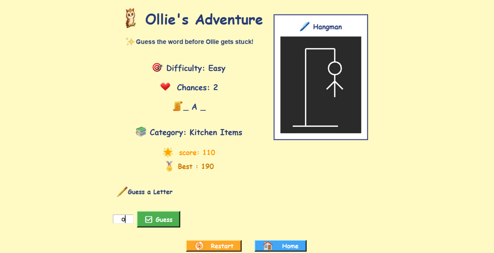
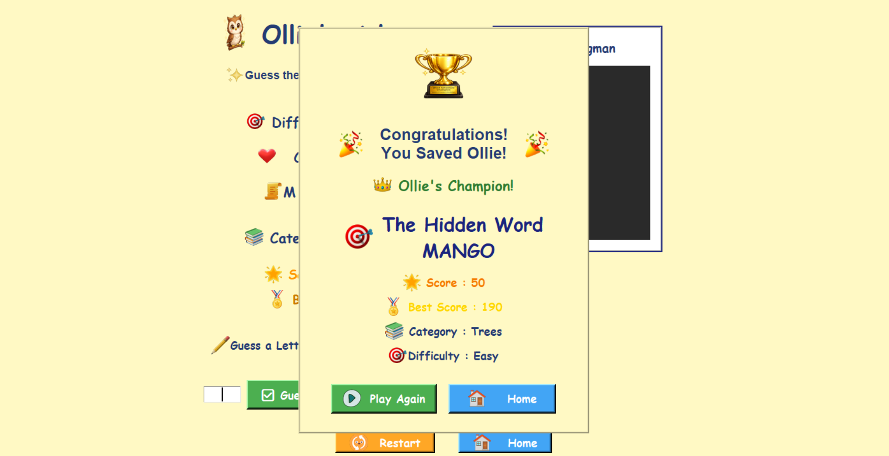
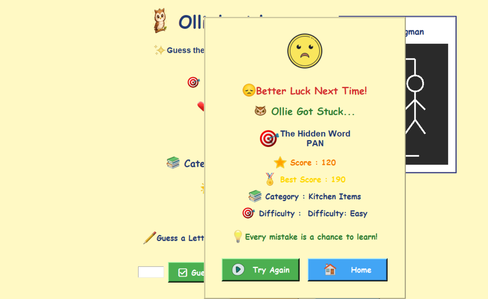
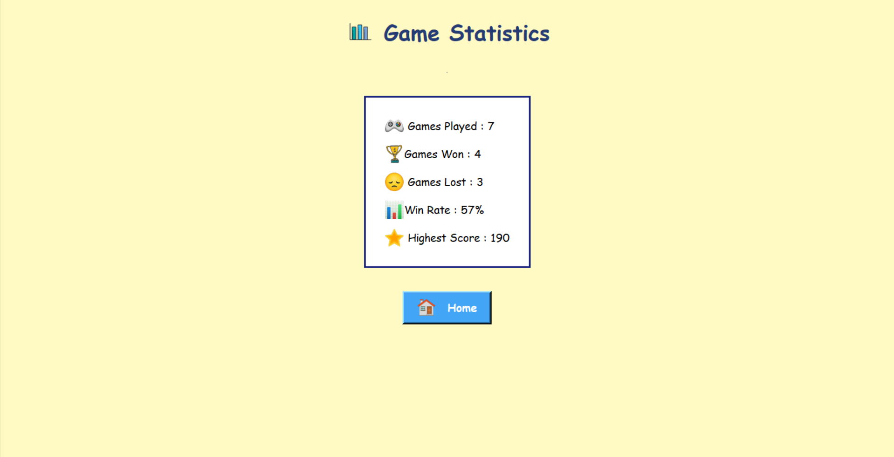
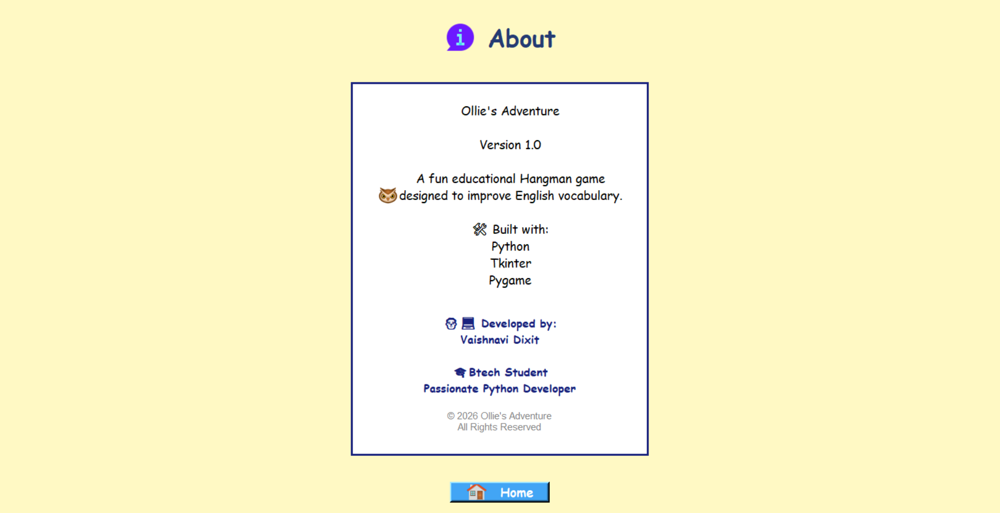

# 🦉 Ollie's Adventure

A fun cartoon-style word adventure game built with **Python**, **Tkinter**, and **Pygame**.

---

# 🎮 About the Game

Ollie's Adventure is an educational Hangman-inspired word game where players help Ollie the Owl guess hidden words across multiple difficulty levels.

The game combines learning, fun animations, sound effects, and colorful graphics into an engaging desktop experience.

---

# ✨ Features

- 🎯 500+ categorized words
- 🟢 Easy Mode
- 🟡 Medium Mode
- 🔴 Hard Mode
- 🎵 Sound Effects
- 🎨 Cartoon User Interface
- 🏆 High Score System
- 📊 Statistics Dashboard
- 💻 Desktop Application (.exe)
- 🦉 Custom Game Icon

---

# 🛠 Technologies Used

- Python 3
- Tkinter
- Pygame
- Pillow (PIL)
- CSV
- JSON
- PyInstaller
- Git
- GitHub

---

# 📂 Project Structure

```
Ollie-Word-Adventure
│
├── Images/
├── sound/
├── Easy_words.csv
├── Medium_words.csv
├── Hard_words.csv
├── game_logic.py
├── game_statistics.py
├── main.py
└── README.md
```

---

# 🚀 How to Run

1. Clone the repository

```bash
git clone https://github.com/20Vaishnavi1985/Ollie-Word-Adventure.git
```

2. Install requirements

```bash
pip install pygame pillow
```

3. Run

```bash
python main.py
```

---

# 📸 Screenshots

## 🏠 Home Screen



---

## 🎮 Gameplay



---

## 🏆 Victory Screen



---

## 💀 Game Over



---

## 📊 Statistics



---

## ℹ️ About



---

# 📈 Future Improvements

- Settings Menu
- More Word Packs
- Achievements
- Multiplayer Mode
- More Animations

---

# 👩‍💻 Developer

**Vaishnavi Dixit a btech AIML student **

Python Developer | Game Developer

---

# ⭐ If you like this project

Please consider giving this repository a ⭐ on GitHub.

